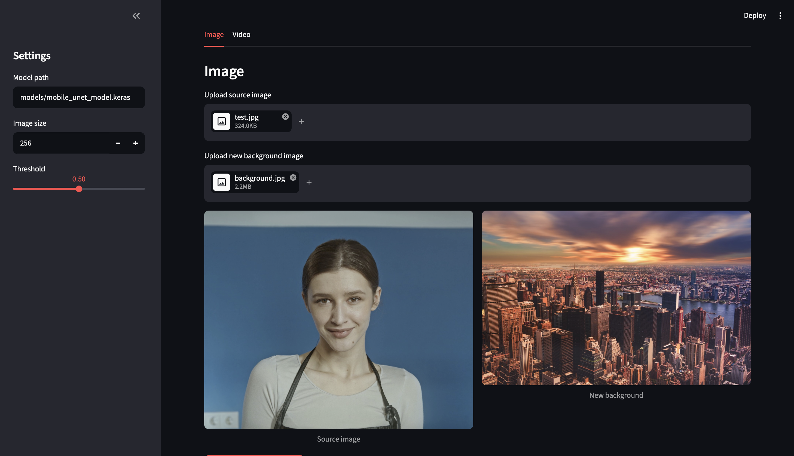
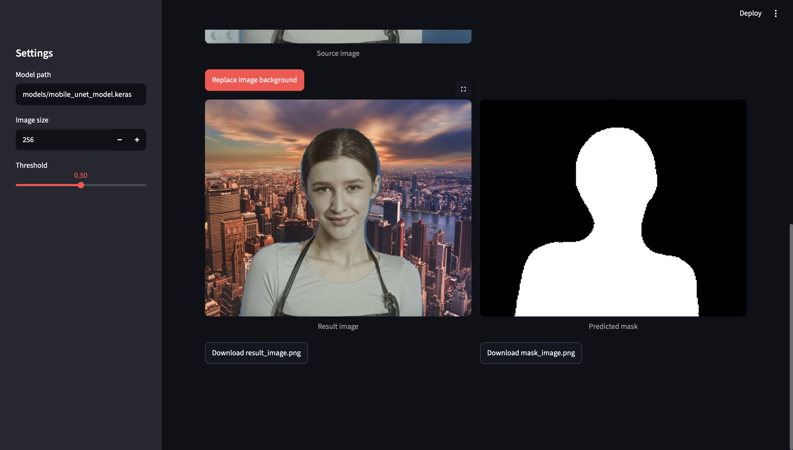
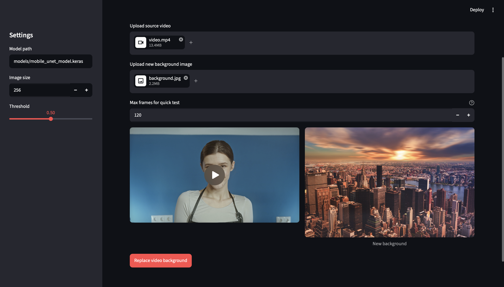
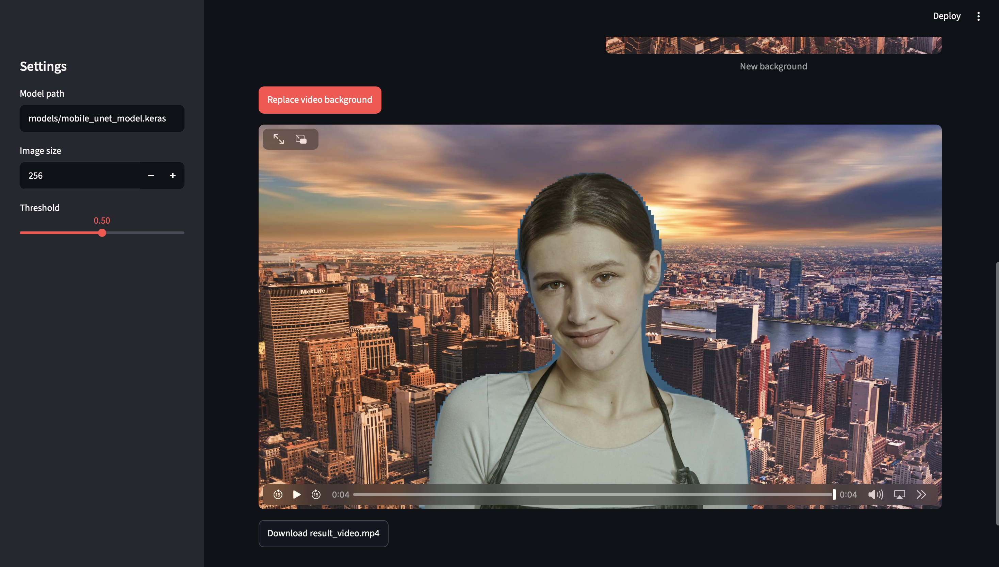

# Person Background Replacement

Person Background Replacement — веб-приложение для замены фона за человеком на изображениях с использованием собственной модели сегментации Mobile U-Net.

Проект демонстрирует полный computer vision pipeline: обучение модели, предсказание маски человека, замену фона, CLI-инференс и деплой веб-приложения на Streamlit Cloud.

## Демо

**Live app:** [person-background-replacement Streamlit demo](https://person-background-replacement-4a4wyhoyvftepbrytn6xff.streamlit.app)

### Демо для изображений

Исходное изображение и новый фон:



Результат замены фона на изображении:



### Демо для видео

Загруженное видео и фон в Streamlit-приложении:



Результат обработки видео в Streamlit-приложении:



Готовое демо-видео: [assets/output-video.mp4](assets/output-video.mp4)

## Возможности

- Сегментация человека с помощью Mobile U-Net
- Замена фона для загруженных изображений
- Инференс-пайплайн на TensorFlow/Keras
- Веб-интерфейс на Streamlit
- CLI-инференс для изображений
- CLI-инференс для видео
- Деплой на Streamlit Cloud

## Стек технологий

- Python
- TensorFlow / Keras
- OpenCV
- NumPy
- Pillow
- Streamlit

## Структура проекта

```text
app_streamlit.py  - Streamlit web interface
src/              - model, losses, inference and video utilities
notebooks/        - training notebook
examples/         - sample input files
models/           - trained model
outputs/          - generated results
```

## Модель

В проекте используется модель сегментации в стиле Mobile U-Net с энкодером MobileNetV2. Модель обучена предсказывать маску человека, которая затем используется для наложения человека с исходного изображения на новый фон.

Ожидаемый путь к модели:

```text
models/mobile_unet_model.keras
```

## Локальный запуск

```bash
pip install -r requirements.txt
streamlit run app_streamlit.py
```

## CLI-инференс

Инференс для изображения:

```bash
python3 main_image.py \
  --image examples/test.jpg \
  --background examples/background.jpg \
  --model models/mobile_unet_model.keras \
  --output outputs/result_image.png \
  --mask-output outputs/mask_image.png
```

Инференс для видео:

```bash
python3 main_video.py \
  --video examples/video.mp4 \
  --background examples/background.jpg \
  --model models/mobile_unet_model.keras \
  --output outputs/result_video.mp4 \
  --max-frames 120
```

## Обучение

Ноутбук с обучением находится здесь:

```text
notebooks/training.ipynb
```

В нём описан процесс обучения модели сегментации человека на основе MobileNetV2 encoder и U-Net style decoder.

## Для портфолио

Проект оформлен как портфолио-кейс для Junior ML Engineer / Data Scientist. Он показывает полный цикл работы над ML/CV-задачей: обучение модели сегментации, инференс, замену фона на изображениях и видео, создание веб-интерфейса и деплой приложения на Streamlit Cloud.

## Примечания

- Для инференса требуется файл обученной модели.
- Большие файлы модели следует хранить через Git LFS.
- Демо-скриншоты и обработанное демо-видео находятся в `assets/`.
- Инференс видео выполняется покадрово, поэтому обработка длинных видео может занимать больше времени.
